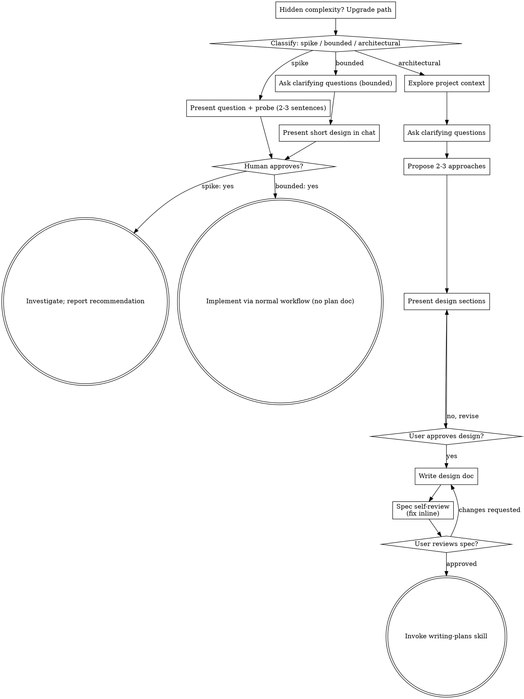

# 把想法头脑风暴成设计

通过自然的协作对话，帮助把想法变成完整成型的设计与规范（spec）。

首先判断这个请求需要多少流程，然后沿着你的路径推进：理解上下文、打磨想法、呈现设计、并获得你的用户伙伴的批准。

<HARD-GATE>
在把你打算做的事情告诉你的用户伙伴并得到他们的批准之前，**不得**调用任何实现技能、编写任何代码、搭建任何项目，或采取任何实现行动。这适用于下面每一条路径上的**每一个**任务——仪式感随任务规模缩放；批准关卡从不缩放。
</HARD-GATE>

## 三条路径

在提出第一个问题之前，对请求进行分类并大声说出分类结果——"这个看起来是受限的，所以我会在这里呈现一个简短设计，而不是写规范"——这样你的用户伙伴可以否决它：

- **Spike（试探）** —— 一个可行性问题（"我们能……吗"、"有可能……吗"、"快速且粗糙就行"），其产出是一个答案，而不是你要保留的代码。用 2-3 句话呈现问题和你将尝试的内容，得到点头同意，然后以正确性所允许的最低成本去查明。不写设计文档，不写规范文件。把发现作为建议（recommendation）汇报；任何你构建的东西都要标注为一次性（throwaway）。
- **Bounded（受限）** —— 对本仓库中已存在的代码做一次界定良好的改动：一个新开关（flag）、一个小端点、一个单文件修复。理解这类应用是什么还不够——bounded 意味着你正在改动的流程已经存在于仓库中、读得到。如果没有现成的流程可改，那这个任务就不是 bounded。提出真正要紧的澄清性问题，在聊天里呈现一个简短设计（几句话到几小段），然后**停下**。只有你的用户伙伴对这个设计说"是"之后才能开始实现——bounded 任务的批准和架构级任务一样是一道硬关卡。不写规范文件，不写实现计划文档。
- **Architectural（架构级）** —— 新项目、新子系统、重组组件之间关系的改动，或改变他人所依赖的接口的改动。遵循完整流程：提问、方案、分段设计、书面规范，然后是 writing-plans 技能（`superpower-writing-plans`，通过 `skill` 工具加载）。

在两个路径之间拿不准时，选择更重的那条。棘轮是单向的：任务中途发现的隐藏复杂性会**升级**路径——停下，说出来，然后升级。任务中途没有任何东西会降级。

## 反模式："太简单了，不需要批准"

每条路径都以你的用户伙伴在实现前批准你的意图而结束。一个待办清单、一个单函数工具、一个配置改动——设计可能只是聊天里的两句话，但你**必须**呈现它并获得批准。"简单"任务正是未经审视的假设造成最多浪费工作的地方。随简单程度缩放的是产物（artifact），绝不是批准。

## 红旗信号（Red Flags）

| 想法 | 现实 |
|---------|---------|
| "这太简单了，不需要设计" | 简单意味着简短的设计，而不是没有设计。聊天里两句话，然后批准。 |
| "我把它称为 bounded 然后跳过规范" | 为了跳过工作而抓取一个标签，这本身就是怀疑——选更重的路径。 |
| "它是 bounded 的，设计显而易见——我趁他们读的时候就开始" | 关卡是批准，不是设计的长度。呈现，然后停下，直到听到"是"。 |
| "我了解这类应用，所以它是 bounded 的" | Bounded 衡量的是仓库，不是你的熟悉程度。新项目没有现成流程——它是架构级的。 |
| "Spike 成功了，所以我保留这段代码" | Spike 的产出是答案。保留代码是一个新的请求——对它重新分类。 |
| "它变大了，但我快完成了——不需要重新分类" | 隐藏复杂性会在任务中途升级路径。停下并说出来。 |
| "他们批准了 spike，所以后续改动也自动获批" | 每个任务都有自己的分类和各自的批准。 |

## 清单（Checklist）

先分类，宣布路径，然后用 `todo_write` 为你的路径上的每个条目创建一条任务，并按顺序完成。

**Spike（试探）：**
1. **探索项目上下文** —— 足以框定试探即可
2. **呈现问题 + 试探计划** —— 2-3 句话
3. **获得批准** —— 点头就够
4. **调查** —— 以正确性所允许的最低成本
5. **汇报发现** —— 给出建议；任何构建出来的东西都标注为一次性

**Bounded（受限）：**
1. **探索项目上下文** —— 检查文件、文档、最近的提交
2. **提出澄清性问题** —— 一次一个，问那些真正要紧的
3. **在聊天中呈现简短设计** —— 方案、要触碰的文件、测试方式
4. **获得批准** —— 停下，等待一个明确的"是"；在同一口气里呈现设计并开始实现就是在跳过关卡
5. **实现** —— 按正常的开发工作流推进（适用 TDD）；不写计划文档

**Architectural（架构级）：**
1. **探索项目上下文** —— 检查文件、文档、最近的提交
2. **（可选）按需提供可视化** —— 不要一上来就提供。只有当某个问题用可视化呈现确实比用文字描述更清晰时，才在那时提供（单独一条消息）。DSH 下这一步非必需——可以自行用浏览器可视化，也可以直接跳过。如果从未出现需要可视化的问题，就永远不要提供。详见下方"可视化伴侣（可选）"一节。
3. **提出澄清性问题** —— 一次一个，理解目的/约束/成功标准
4. **提出 2-3 个方案** —— 附权衡和你推荐的方案
5. **呈现设计** —— 按各部分的复杂度缩放，每部分之后获得用户批准
6. **写设计文档** —— 保存到 `docs/superpowers/specs/YYYY-MM-DD-<topic>-design.md` 并提交（commit）
7. **规范自审** —— 快速内联检查占位符、矛盾、歧义、范围（见下文）
8. **用户审阅书面规范** —— 在继续之前请用户审阅规范文件
9. **过渡到实现** —— 调用 `superpower-writing-plans` 技能创建实现计划

## 流程（Process Flow）

**终态与路径绑定。** 架构级：brainstorming 之后唯一能调用的技能是 `superpower-writing-plans`——绝不是前端设计（frontend-design）、mcp-builder 或任何其它实现技能。受限级：批准之后，实现直接通过正常的开发工作流进行；不写计划文档。试探级：终态是一个汇报出来的建议。

## 流程（The Process）

下面的小节服务于 bounded 和 architectural 路径（spike 止步于"呈现试探、得到点头"）。从**探索方案**开始的小节是 architectural 路径的深度——对于 bounded 工作，上下文加几个问题加聊天里一个简短设计就是全部流程。

**理解想法：**

- 先查看当前项目状态（文件、文档、最近的提交）
- 在提出细节问题之前，先评估范围：如果请求描述多个独立的子系统（例如"构建一个带聊天、文件存储、计费和分析的平台"），立即标记出来。不要把问题浪费在打磨一个需要先分解的项目的细节上。
- 如果项目太大、无法放进单一规范，帮助用户分解成子项目：独立的部件是什么、它们如何关联、应该按什么顺序构建？然后按正常设计流程对第一个子项目做头脑风暴。每个子项目都有自己 规范 → 计划 → 实现 的循环。
- 对于范围合适的项目，一次一个问题来打磨想法
- 尽可能用多选题，但开放式问题也可以
- 每条消息只问一个问题——如果一个话题需要更多探索，拆成多个问题
- 聚焦于理解：目的、约束、成功标准

**探索方案：**

- 提出 2-3 个不同方案并附权衡
- 以对话方式呈现选项，给出你的推荐与理由
- 用你推荐的选项开头并解释为什么
- 无情地 YAGNI——从每个方案和设计中移除不必要的功能

**呈现设计：**

- 一旦你认为自己理解了要构建什么，就呈现设计
- 按各部分的复杂度缩放：直白的话几句话，微妙的话最多 200-300 字
- 每个部分之后问是否看起来没问题
- 覆盖：架构、组件、数据流、错误处理、测试
- 如果某处讲不通，准备好回头澄清

**为隔离与清晰而设计：**

- 把系统拆成更小的单元，每个单元有一个明确目的，通过定义良好的接口通信，并能被独立理解和测试
- 对每个单元，你应当能回答：它做什么、怎么用它、它依赖什么？
- 别人不读它的内部实现能理解这个单元做什么吗？你能在不破坏使用方的情况下改动内部实现吗？如果不能，边界需要打磨。
- 更小、边界良好的单元也更容易让你工作——你能更好地推理能一次性放进上下文的代码，文件专注时你的编辑也更可靠。当文件变得很大，这往往是它做得太多的信号。

**在既有代码库中工作：**

- 在提议改动之前探索当前结构。遵循既有模式。
- 当既有代码存在影响工作的问题时（例如文件变得过大、边界不清、职责纠缠），把有针对性的改进作为设计的一部分——就像好开发者在他们工作的代码里改进代码那样。
- 不要提议无关的重构。聚焦于服务当前目标的东西。

## 设计之后（architectural 路径）

**文档：**

- 把验证过的设计（spec）写到 `docs/superpowers/specs/YYYY-MM-DD-<topic>-design.md`
  - （用户对规范位置的偏好覆盖此默认值）
- 如果可用，用 `skill` 工具加载 elements-of-style:writing-clearly-and-concisely 技能
- 把设计文档提交到 git

**规范自审：**

写完规范文档后，用新的眼光看它：

1. **占位符扫描：** 有任何 "TBD"、"TODO"、不完整的部分或含糊的需求吗？修复它们。
2. **内部一致性：** 各部分之间相互矛盾吗？架构与功能描述匹配吗？
3. **范围检查：** 这对单一实现计划来说足够聚焦，还是需要分解？
4. **歧义检查：** 有没有哪个需求可能被以两种不同方式理解？如果有，选一种并明确写出来。

内联修复任何问题。无需重新审阅——修复后继续。

**用户审阅关卡：**

规范审阅循环通过后，在继续之前请用户审阅写好的规范：

> "规范已写好并提交到 `<path>`。请审阅它，并告诉我是否要在我们开始写实现计划之前做任何修改。"

等待用户回应。如果他们要求修改，就修改并重新运行规范审阅循环。只有用户批准后才继续。

**实现：**

- 调用 `superpower-writing-plans` 技能创建详细的实现计划
- **不要**调用任何其它技能。writing-plans 是下一步。

## 可视化伴侣（可选，DSH 下非必需）

原版 Superpowers 附带一个基于浏览器的可视化伴侣，用于在头脑风暴中展示 mockup、图表和视觉选项。DSH 没有捆绑其服务器与脚本（`scripts/` 未移植）；这一步在 DSH 下是可选的——如果某个问题用可视化呈现更清晰，你可以自行用浏览器可视化（例如用 `write` 写一个自包含的 HTML 文件，或用 `bash` 以 `run_in_background: true` 运行一个静态文件服务器让用户打开），但并非必需。

**按问题决策：** 即便决定使用可视化，也要**针对每个问题**判断用浏览器还是终端。判据：**用户"看到"它比"读到"它理解得更好吗？**

- **用浏览器**呈现本身是视觉的内容——mockup、线框图、布局对比、架构图、并排的视觉设计
- **用终端**呈现文本内容——需求问题、概念选择、权衡清单、A/B/C/D 文本选项、范围决策

关于 UI 主题的问题不自动是视觉问题。"在这个语境下 personality 是什么意思？"是概念问题——用终端。"哪个向导布局更好？"是视觉问题——用浏览器。

如果用户同意可视化，详细指南见 `visual-companion.md`。
