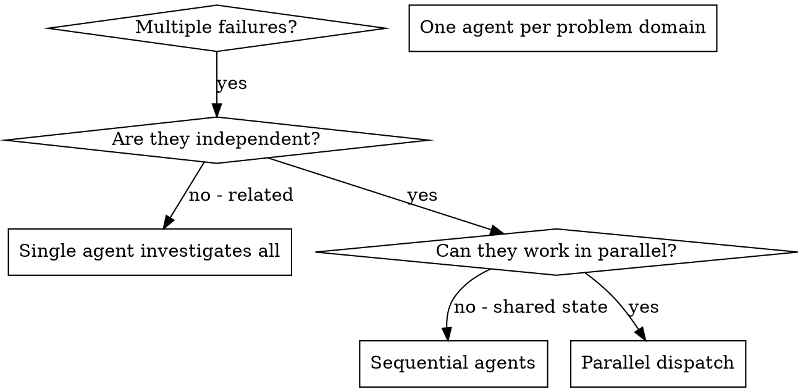

# 并行派发子代理

## 概览

你把任务委派给拥有隔离上下文的专门子代理。通过精确构造它们的指令与上下文，你确保它们保持专注并成功完成任务。它们永远不应该继承你会话的上下文或历史——你精确构建它们所需要的一切。这也为你自己的协调工作保留了上下文。

当你面对多个互不相关的失败（不同的测试文件、不同的子系统、不同的缺陷）时，逐个顺序调查会浪费时间。每次调查都是独立的，可以并行进行。

**核心原则：** 每个独立问题域派发一个子代理，让它们并发工作。

## 何时使用



**使用场景：**
- 3 个以上测试文件因不同的根因失败
- 多个子系统被独立破坏
- 每个问题都能在不借助其它问题上下文的情况下理解
- 各调查之间没有共享状态

**不要使用的场景：**
- 失败相互关联（修一个可能连带修好其它）
- 需要理解完整系统状态
- 子代理之间会相互干扰

## 模式

### 1. 识别独立的问题域

按损坏内容对失败分组：
- 文件 A 测试：工具审批流程
- 文件 B 测试：批量完成行为
- 文件 C 测试：中止功能

每个域相互独立——修复工具审批不会影响中止测试。

### 2. 创建聚焦的子代理任务

每个子代理得到：
- **具体范围：** 一个测试文件或子系统
- **清晰目标：** 让这些测试通过
- **约束：** 不要改动其它代码
- **预期输出：** 你发现和修复内容的摘要

### 3. 并行派发

在同一条消息中发出所有三个子代理派发——它们并行运行：

```text
subagent(description: "修复 agent-tool-abort.test.ts 的失败", prompt: "……")
subagent(description: "修复 batch-completion-behavior.test.ts 的失败", prompt: "……")
subagent(description: "修复 tool-approval-race-conditions.test.ts 的失败", prompt: "……")
# 三个调用在同一个响应中发出 → 全部并发运行。
```

在 DSH 中，`subagent` 默认在后台运行：同一条消息里的多个 `subagent` 调用 = 并行执行；一次只发一个 = 顺序执行。需要等待某个子代理的结果再继续时，给它设 `run_in_background: false`。需要子代理继承当前会话上下文时用 `subagent_fork`。派发后可用 `list_agents` 查看子代理状态、`send_message` 继续与子代理对话、`interrupt_agent` 请求中断仍在运行的子代理。

对于需要大规模扇出编排的场景（例如 10+ 个相互独立的子任务），可以用 `workflow` 工具作为替代：写一段 JS 编排脚本，用脚本内的 `agent()` 并行派发多个子代理并汇总结构化结果——比逐条手写 `subagent` 调用更适合大规模扇出。

### 4. 审查并整合

当子代理返回时：
- 阅读每份摘要
- 验证修复互不冲突
- 运行完整测试套件
- 整合所有改动

## 子代理提示词结构

好的子代理提示词：
1. **聚焦** —— 一个清晰的问题域
2. **自包含** —— 理解问题所需的全部上下文
3. **明确输出** —— 子代理应该返回什么？

```markdown
修复 src/agents/agent-tool-abort.test.ts 中失败的 3 个测试：

1. "should abort tool with partial output capture" —— 期望消息中包含 'interrupted at'
2. "should handle mixed completed and aborted tools" —— 快速工具被中止而不是完成
3. "should properly track pendingToolCount" —— 期望 3 个结果却得到 0

这些是时序/竞态条件问题。你的任务：

1. 阅读测试文件，理解每个测试验证什么
2. 找出根因——时序问题还是真正的缺陷？
3. 修复方式：
   - 用基于事件的等待替换任意超时
   - 如果发现中止实现中的缺陷则修复
   - 如果测试的是已改变的行为则调整测试期望

不要只是加大超时——找到真正的问题。

返回：你发现了什么、修复了什么。
```

## 常见错误

**❌ 太宽泛：** "修复所有测试" —— 子代理会迷失方向
**✅ 具体：** "修复 agent-tool-abort.test.ts" —— 范围聚焦

**❌ 没有上下文：** "修复这个竞态条件" —— 子代理不知道在哪里
**✅ 有上下文：** 粘贴错误消息和测试名

**❌ 没有约束：** 子代理可能重构一切
**✅ 有约束：** "不要改生产代码" 或 "只修测试"

**❌ 输出含糊：** "修复它" —— 你不知道改了什么
**✅ 输出明确：** "返回根因和改动的摘要"

## 何时不要使用

**关联失败：** 修一个可能连带修好其它——先一起调查
**需要完整上下文：** 理解需要看到整个系统
**探索式调试：** 你还不知道哪里坏了
**共享状态：** 子代理会相互干扰（编辑同一文件、使用同一资源）

## 会话中的真实示例

**场景：** 大规模重构后 3 个文件出现 6 个测试失败

**失败：**
- agent-tool-abort.test.ts：3 个失败（时序问题）
- batch-completion-behavior.test.ts：2 个失败（工具未执行）
- tool-approval-race-conditions.test.ts：1 个失败（执行计数 = 0）

**决策：** 独立域——中止逻辑独立于批量完成、独立于竞态条件

**派发：**
```
子代理 1 → 修复 agent-tool-abort.test.ts
子代理 2 → 修复 batch-completion-behavior.test.ts
子代理 3 → 修复 tool-approval-race-conditions.test.ts
```

**结果：**
- 子代理 1：用基于事件的等待替换超时
- 子代理 2：修复事件结构缺陷（threadId 位置错误）
- 子代理 3：增加对异步工具执行完成的等待

**整合：** 所有修复相互独立，无冲突，完整套件全绿

## 验证

子代理返回后：
1. **审查每份摘要** —— 理解改了什么
2. **检查冲突** —— 子代理是否编辑了同一代码？
3. **运行完整套件** —— 验证所有修复协同工作
4. **抽查** —— 子代理可能犯系统性错误