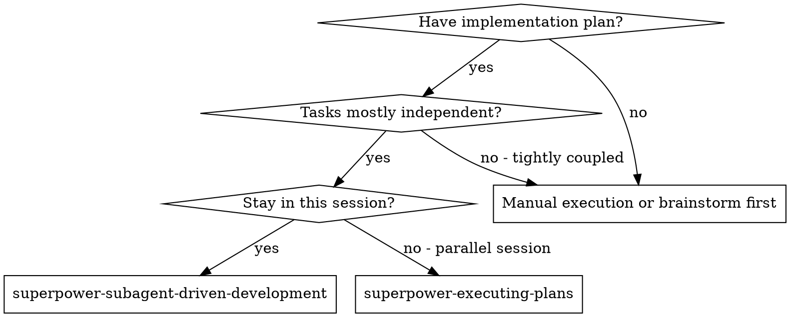
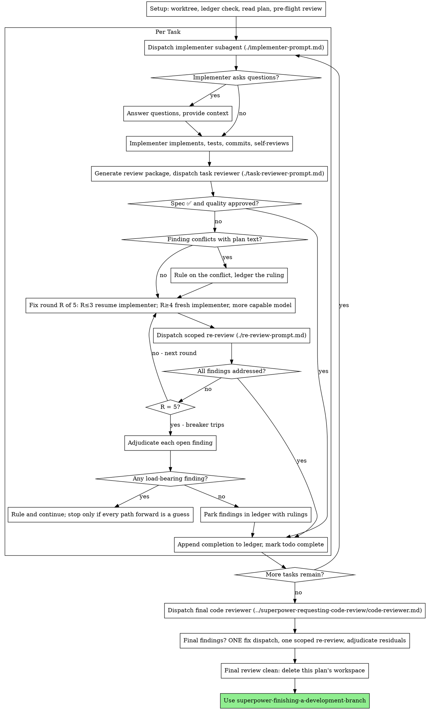

# 子代理驱动的开发

按计划执行：每个任务派发一个全新的实现子代理，每个任务之后做一次任务评审（规范符合性 + 代码质量），最后做一次全分支的宽泛评审。

**为什么用子代理：** 你把任务委派给拥有隔离上下文的专门子代理。通过精确构造它们的指令与上下文，你确保它们保持专注并成功完成任务。它们永远不应该继承你会话的上下文或历史——你精确构建它们所需要的一切。这也为你自己的协调工作保留了上下文。

**核心原则：** 每个任务一个全新子代理 + 任务评审（规范 + 质量）+ 最终宽泛评审 = 高质量、快速迭代

**叙述：** 在工具调用之间，最多叙述一行——台账和工具结果承载记录。

**持续执行：** 不要在任务之间停下来向人类伙伴确认。不间断地执行计划中的所有任务。唯一停止的理由是下面列出的四种，或所有任务已完成。"我该继续吗？"式的提示和进度摘要浪费他们的时间——他们让你执行计划，那就执行。

**裁决，而非停滞。** 运行中的计划不会等待人类。冲突、歧义、计划缺陷、你本来想问的超出上限——都由你决定。规范是约束性权威，计划是它的论证，你的判断解决两者都未回答的问题。把每个决定记入台账，格式为 `Ruling: <你决定了什么> — <为什么> — <如果错了要付出什么代价>`，然后继续。一个错误的裁决代价是返工，人类伙伴看得见也能撤销；而一个停在问题上的会话会浪费他们一整天且一无所获。

有四件事会停下你，且只有这四件：不可逆或破坏性操作；安全敏感操作；此 worktree 之外、按惯例应先询问的副作用（合并、推送到共享分支、发布）；以及计划坏到每一条路都是猜测。遇到这些，停下来问。

## 何时使用



**vs. 执行计划（并行会话）** —— superpower-executing-plans：
- 同一会话（无上下文切换）
- 每个任务全新子代理（无上下文污染）
- 每个任务后评审（规范符合性 + 代码质量），最后宽泛评审
- 迭代更快（任务之间无人肉循环）

## 流程



## 准备

确保工作在隔离的工作区中进行：用 superpower-using-git-worktrees（通过 `skill` 工具加载）创建一个，或验证已有的。没有人类伙伴的明确同意，绝不要在 main/master 分支上开始实现。

会话记忆无法在压缩（compaction）后幸存。在真实会话中，丢失位置的控制器重新派发了整段已完成的任务序列——这是观察到的代价最高的失败。把进度记在台账文件中，而不仅仅记在 todos 里。

- 每个计划拥有一个工作区：技能开始时，创建该计划的 git-ignored 目录（`<repo-root>/.superpowers/sdd/<plan-basename>/`），它是本计划所有产物的家：台账、简报、报告、评审包。（原技能用 `scripts/sdd-workspace PLAN_FILE` 脚本完成这件事，DSH 版没有移植该脚本，内联执行：用 `bash` 运行 `mkdir -p <repo-root>/.superpowers/sdd/<plan-basename>/` 并记下路径。）其它计划的目录绝不属于你读写。
- 检查本计划的台账是否在 `<workspace>/progress.md`。如果它的第一行写着你的计划文件名，那么带 `Task <N>: complete` 行的任务已经完成——不要重新派发它们；从第一个没有该行的任务继续。最后一个以 fix round 行结尾的任务处于循环中：从下一轮恢复循环。第一行写着别的计划文件名的台账——或散落在旧扁平路径 `.superpowers/sdd/progress.md` 的台账——是另一个计划的进度：保持原样，自己新建一份。
- 用身份行创建台账：`# SDD ledger — plan: <plan file path>`。
- 台账是你的恢复地图：它点名的提交在 git 里真实存在，即使你的上下文已不记得创建过它们。压缩之后，相信台账和 `git log`，而不是你自己的记忆。
- `git clean -fdx` 会毁掉工作区（它是 git-ignored 的临时区）；如果发生了，从 `git log` 恢复。

把计划读一遍，记下它的上下文和全局约束，为每个任务创建一个 todo（用 `todo_write`，每次发送完整列表）。如果计划指名了 Spec，也读它：规范是计划据以论证的权威，计划内部的冲突以它为准。没有可达规范的计划在台账里记一笔说明——没有规范做出的裁决都是临时的。

派发任务 1 之前，把计划扫描一遍找冲突，边扫边写下你检查了什么：

- 相互矛盾、或与计划全局约束矛盾的任务
- 计划明确要求、但评审准则视为缺陷的东西（断言什么都不测的测试、逐字复制的逻辑块）

扫描的输出是一张表，不是判决。共享同一文件或同一接口的每对任务一行：两个任务、一个产出对另一个的消费、你发现了什么。每个任务一行：它自己的文本是否自洽——它指定的测试对它指定的代码、它创建的文件对它后来触碰的文件。"扫描是干净的"而没有这些行，就不是你做过扫描。

把表写进台账。执行开始前裁决你发现的每一条——每条都是针对强制它的计划文本——并把每条裁决记入台账。如果扫描干净，直接继续，不评论。裁决它暴露的每个冲突——规范是约束性权威，计划是它的论证——把裁决记在对应行旁边，然后派发任务 1。评审循环仍然是那些只有实现才能暴露的冲突的兜底网。

## 模型选择

用能胜任每个角色且最弱的模型，以节省成本、提高速度。

**机械性实现任务**（隔离的函数、清晰的规范、1-2 个文件）：用快速、便宜的模型。计划写得好的时候，大多数实现任务都是机械性的。

**集成与判断任务**（多文件协调、模式匹配、调试）：用标准模型。

**架构与设计任务**：用可用的最强模型。最终的全分支评审属于这一类——用可用的最强模型派发，而不是会话默认模型。

**评审任务**：选择判断力相当、并按 diff 的大小、复杂度和风险调整的模型。小的机械性 diff 不需要最强模型；微妙的并发改动需要。小修复 diff 的定点复审用便宜到中档。

**修复循环升级（第 4-5 轮）**：用至少比卡住的实现者高一档的模型。

**派发子代理时始终显式指定模型。** 省略的模型会继承你会话的模型——通常是最强也最贵的——悄悄毁掉本节。（DSH 注：`subagent` 工具本身不暴露模型参数；如果平台支持在派发时指定模型——例如 `workflow` 编排脚本中的 `agent()` 支持 `model`/`provider` 覆盖——就显式指定。若不支持，至少保持角色分层的心智模型，并在升级轮用更强的模型重新派发。）

**轮数胜过 token 价格。** 墙钟时间和上下文成本随子代理的轮数增长，而最便宜的模型在多步工作上通常多花 2-3 倍的轮数——总成本更高。把中档模型作为评审者、以及从散文描述工作的实现者的下限。当任务的计划文本包含要写的完整代码时，实现就是抄写加测试：那个实现者用最便宜档。单文件机械性修复也用最便宜档。

**任务复杂度信号（实现任务）：**
- 触碰 1-2 个文件且有完整规范 → 便宜模型
- 触碰多个文件且有集成顾虑 → 标准模型
- 需要设计判断或广泛的代码库理解 → 最强模型

## 任务循环

**批量处理小的同形工作。** 当计划列出多个同类的小型独立编辑——同样的单行修复、常量修改或字段添加跨文件重复——不要每个任务派发一个子代理。把每个文件及其改动列进 ONE 份派发简报，把整批发给一个子代理，把它的 diff 作为一个单元评审。只有当工作需要自己的判断、自己的测试、或自己的评审面时，才保留一任务一派发。

你粘进派发提示词的每样东西——以及子代理打印回来的每样东西——都会在会话剩余时间里驻留在你的上下文中，并在之后的每个回合被重读。把手工作产物作为文件传递。

**评审包（内联程序）：** 原技能用 `scripts/review-package PLAN_FILE BASE HEAD` 脚本生成评审包；DSH 版没有移植该脚本，用内联 bash 命令代替（这也是原技能记载的无脚本替代方案）。把提交列表、stat 摘要和带上下文的完整 diff 重定向到一个唯一命名的文件：

```bash
{ git log --oneline BASE..HEAD; echo "---"; git diff --stat BASE..HEAD; echo "---"; git diff -U10 BASE..HEAD; } > <workspace>/review-<head7>.diff
```

输出绝不进入你自己的上下文；评审者一次 `read` 调用看到全部内容。BASE 是派发实现者前记录的提交（见下），绝不用 `HEAD~1`——它会悄悄丢掉多提交任务除最后一提交外的全部。

**等待已派发的子代理：** 绝不用短超时轮询等待接口（`job_output` 带 `wait: true` 用于真正需要阻塞的等待），也绝不坐在一次无声的无界等待里。当你有本地工作——更新台账、打包下一次评审、读报告——继续干活；子代理结果会自己到达。当你真的空闲时，用有界的等待段（五分钟到十分钟，平台允许的话），段与段之间发一行状态并调和你的在线子代理：用 `list_agents` 列出它们，追查那些已结束却没报告的孩子。有界等待段保留了长等待的几乎全部效率，同时保证卡住或丢失的子代理在几分钟内被发现，而不是在会话结束时。

### 1. 派发实现者

派发前记录 BASE（`git rev-parse HEAD`）——评审包和修复轮 diff 需要它。

- **任务简报：** 派发实现者之前，把任务 N 的完整文本抽取到一个唯一命名的文件（`<workspace>/task-N-brief.md`）并记下路径。（原技能用 `scripts/task-brief PLAN_FILE N` 完成，DSH 版内联：用 `bash` 按任务编号把计划文本切出写入该文件，或直接用 `write` 工具把任务文本写成简报文件。）组派发时让简报成为需求的唯一来源。你的派发应包含：(1) 一行说明该任务在项目中的位置；(2) 简报路径，以"先读这个——这是你的需求，其中的精确值要逐字使用"引入；(3) 简报无法知道的、来自更早任务的接口与决定；(4) 你在简报中注意到的任何歧义的裁决；(5) 报告文件路径和报告契约。精确值（数字、魔法字符串、签名、测试用例）只出现在简报里。绝不让子代理读整个计划文件。
- **报告文件：** 报告文件按简报命名（简报 `…/task-N-brief.md` → 报告 `…/task-N-report.md`），并放进派发提示词。实现者把完整报告写在那里，只返回状态、提交、一行测试摘要和顾虑。
- 一份派发提示词描述一个任务，不是会话的历史。不要把积累的先前任务摘要（"任务 1-3 之后的状态"）粘进后续派发——真实会话里一次派发冲到 42k 字符，其中 99% 是粘贴的历史。全新子代理需要它的任务、它触碰的接口和全局约束。其它都不需要。
- 派发携带不派子代理契约（它在实现者模板里）：实现者绝不派发子代理——不派帮手，尤其不派评审者。评审来自你，在报告之后。真实会话里，每个 worker 生出的评审者都复制了控制器本来就派发的任务评审——每个任务多一个完整的评审席位。
- 如果更早的任务在该任务触碰的区域停泊过一条 finding，在派发里带上指向那条台账条目的指针。
- 从派发结果记录实现者的代理身份（`subagent` 返回的 subagent id）——修复循环第 1-3 轮用 `send_message` 恢复这个代理。
- 绝不并行派发多个实现子代理（会冲突）。

模板：[implementer-prompt.md](implementer-prompt.md)

### 2. 处理报告

实现者子代理报告四种状态之一。分别处理：

**DONE：** 生成评审包（用上面的内联 bash 程序，BASE 是派发实现者前记录的提交——绝不用 `HEAD~1`），然后带着打印出的路径派发任务评审者。

**DONE_WITH_CONCERNS：** 实现者完成了工作但标记了疑虑。继续前先读这些顾虑。如果顾虑关乎正确性或范围，在评审前处理。如果只是观察（如"这个文件变大了"），记下并继续评审。

**NEEDS_CONTEXT：** 实现者需要未提供的信息。提供缺失的上下文并重新派发。

**BLOCKED：** 实现者无法完成任务。评估阻塞：
1. 如果是上下文问题，提供更多上下文并用同一模型重新派发
2. 如果任务需要更多推理，用更强的模型重新派发
3. 如果任务太大，拆成更小的块
4. 如果计划本身错了，裁决修正、记入台账、带着裁决重新派发

**绝不要**无视一次升级，或强迫同一模型不带变化地重试。如果实现者说它卡住了，一定有东西要变。

如果实现者提问——开始前或中途——清晰完整地回答，必要时提供额外上下文，不要催它进入实现。

### 3. 评审任务

每次任务评审是任务范围的闸门。宽泛评审只在最后、作为全分支评审发生一次。绝不要跳过任务评审，也绝不要接受缺少任一判决的报告——规范符合性 AND 任务质量都必须有。实现者的自评绝不可替代任务评审；两者都需要。

- 把它的 diff 作为文件交给评审者：运行上面定义的内联评审包程序（BASE..HEAD），把打印出的文件路径交给评审者。输出绝不进入你自己的上下文；评审者一次 `read` 调用看到提交列表、stat 摘要和带上下文的完整 diff。使用派发实现者前记录的 BASE——绝不用 `HEAD~1`，它会悄悄截断多提交任务。绝不在没有 diff 文件的情况下派发任务评审者。
- **评审者输入：** 任务评审者拿到三个路径——同一份简报文件、报告文件和评审包——加上约束该任务的全局约束。
- 你交给评审者的全局约束块是它的注意力透镜。从计划的 Global Constraints 节或规范里逐字复制绑定要求：精确值、精确格式、组件之间陈述的关系（"布局同 X"、"与 Y 匹配"）。评审者模板已携带过程规则（YAGNI、测试卫生、评审方法）——约束块是给本项目规范要求的东西。
- 不要添加开放式指令，如"检查所有用法"或"如果有用就跑竞态测试"，除非有具体、任务特定的理由。
- 不要要求评审者重跑实现者已对同一代码跑过的测试——实现者的报告携带测试证据。
- 不要替评审者预判 finding——绝不指示评审者忽略或不标记某个具体问题。如果你认为某个 finding 会是误报，让评审者提出它，然后在评审循环里裁决。如果你正在写的提示词里有"不要标记"、"别把 X 当缺陷"、"最多 Minor"或"计划选择了"——停下：你在预判，通常是省掉自己一个评审循环。
任务评审者可能报告 "⚠️ 无法从 diff 验证" 项——存在于未改动代码中或跨任务的验收要求。它们不阻塞评审的其余部分，但你在标记任务完成前必须自己逐条解决：你掌握评审者没有的计划和跨任务上下文。如果你确认某条是真实缺口，把它当失败的规范评审处理——它带着其它 findings 进入修复循环。

模板：[task-reviewer-prompt.md](task-reviewer-prompt.md)

### 4. 修复循环

当评审报告规范 ❌、任何 Critical 或 Important finding、或你确认为真实缺口的 ⚠️ 项时，循环触发。

循环开始前，有两条路立即离开它：

- 边走边把 Minor findings 记进进度台账（`Task <N>: minor (deferred): <一句话>`），并让最终全分支评审对着那张清单分诊哪些必须在合并前修复。没人读的汇总就是无声丢弃。Minor findings 永不进入循环。
- 标记为 plan-mandated 的 finding——或任何与计划文本要求冲突的 finding——由你裁决：把 finding 与计划文本权衡，以规范为约束性权威做决定，在行动前把裁决记入台账。不要因为计划强制它就驳回 finding，也不要在没有记录裁决的情况下派发与计划矛盾的修复。
其余一切都进入循环。一个修复轮 = 一次修复派发 + 一次定点复审。每个任务最多五轮：

**第 1-3 轮——恢复原实现者。** 把未决 findings 逐字发给它（DSH：用 `send_message` 给派发时记录的 subagent id 发消息）。它的上下文完好：它知道任务、代码和自己的选择。如果 `send_message` 失败（消息未送达，例如子代理已不可恢复），就派发一个携带简报路径、报告文件路径和 findings 的全新实现者——报告文件无论哪种方式都是持久记忆。

**第 4-5 轮——用更强的模型派发全新实现者**（按模型选择），带简报路径、报告文件路径、未决 findings 和这段框架："一个先前的实现者尝试过这个任务 [N] 次；现在你接手。读报告文件了解试过什么。"一个撑过三次恢复的循环通常意味着实现者看不见自己的问题——新眼睛和一次能力提升一步到位。

**每一轮，无论哪种方式：** 实现者修复、重跑覆盖改动代码的测试、把修复报告追加到同一份报告文件、返回短契约。重新派发评审者之前，确认修复报告包含覆盖测试、运行的命令和输出；三者齐备后再派发复审。在修复消息里点名覆盖测试文件——一行修复不需要整个套件。

**复审是定点的。** 运行内联评审包程序，FIX_BASE 是上一次评审看到的 head，派发 [re-review-prompt.md](re-review-prompt.md)，带 findings 清单、简报、报告文件和打印出的 diff 路径。复审者逐条裁决每个 finding 为 ADDRESSED 或 NOT ADDRESSED，并且只标记修复 diff 中的新破坏。修复 diff 中新的 Critical/Important 破坏加入未决 findings 清单。范围外的观察进台账作为延后 minor——它们绝不延长循环。

**每轮之后，** 追加到台账：
`Task <N>: fix round <R>/5 (<X> addressed, <Y> open — <finding one-liners>; commits <a7>..<b7>)`

绝不在控制器会话里自己修 finding——你的上下文要干净地留给协调，控制器修复还跳过评审。

**断路器。** 当第 5 轮复审仍有 findings 未决，停止派发。你自己裁决每条未决 finding——你掌握评审者没有的计划和跨任务上下文：

- **评审者错了，或论点有争议：** 停泊——`Task <N>: parked — <finding> — Ruling: <为什么代码成立>`。最终评审看到双方。
- **真实，但下游没有东西建立在它上面：** 同样停泊，裁决说明它真实且延后。
- **真实且承重**——后面的任务建立在它上面，或它暴露了计划缺陷：裁决能解锁依赖工作的最小改动，记入台账为 `Task <N>: Ruling: <finding> — <你决定了什么和为什么>`，并带进下一个任务的派发。无声停泊一个结构性失败，会让每个依赖任务都建立在它上面。只有当缺陷让每条路都是猜测时才停。

只在上限处裁决。更早裁决来结束循环是换了个名字的预判。每次裁决都是一条台账条目——无声丢弃是禁止的。

### 5. 完成任务

当评审干净返回——或在上限处每条未决 finding 都带裁决停泊——在与其它簿记同一条消息里把完成行追加到台账：

- `Task <N>: complete (commits <base7>..<head7>, review clean)`
- 断路器触发后：`Task <N>: complete (commits <base7>..<head7>, <K> parked)`

然后标记 todo 完成（`todo_write` 发送完整列表）并继续。只要评审还有既未修复、也未在上限处带裁决停泊的未决 Critical/Important 问题，就绝不进入下一个任务。

## 最终评审

最终全分支评审也有一个包：运行内联评审包程序，MERGE_BASE = 分支开始的提交（如 `git merge-base main HEAD`），把打印出的路径放进最终评审派发，这样最终评审者读一个文件而不是用 git 命令重新推导分支 diff。用可用的最强模型派发（见模型选择），使用 superpower-requesting-code-review 的 code-reviewer 提示词模板（通过 `skill` 工具加载该技能取得模板）。让它对着台账里延后 minor 和停泊行，以便分诊哪些必须在合并前修复。

如果最终全分支评审返回 findings，派发 ONE 个携带完整 findings 清单的修复子代理——不是一个 finding 一个修复者。逐 finding 的修复者各自重建上下文、重跑套件；真实会话里最终评审的修复波花费超过它所有任务的总和。然后对修复波恰好运行一次定点复审（内联程序取修复区间，[re-review-prompt.md](re-review-prompt.md)）。像任务循环的断路器那样裁决任何残余 findings：带裁决停泊，或裁决承重的并记入台账。这里只有上面四类能停下你。没有第二波修复——残余的承重 findings 会在 finishing-a-development-branch 呈现选项时浮到人类伙伴面前。

## 收尾

删除任何东西之前，收集台账里所有含 `Ruling:` 的行——预检裁决、停泊的 findings、断路器裁决，全部——按做出顺序放进你最后一条消息的 "Rulings I made" 之下，每条附上如果错了的代价。清单是穷尽的：台账里有一条裁决，清单里就有一条。这份清单是你替人类伙伴做的决定到达他们那里的唯一途径——他们读它，返工你搞错的部分。一条随工作区一起死去的裁决，是暗地里做的决定。

当最终全分支评审干净且其修复已合并，删除本计划的工作区（`rm -rf <workspace>`）——git 历史现在是记录。兄弟目录属于其它计划；别碰它们。

使用 superpower-finishing-a-development-branch（通过 `skill` 工具加载）。

## 常见合理化借口

| 借口 | 现实 |
|--------|--------|
| "规范符合性差不多就行了" | 评审者发现规范缺口 = 没完成。修复或撞上限并裁决——只有这两条出路。 |
| "我自己修吧，派发是开销" | 控制器修复污染你的上下文并跳过评审。恢复实现者。 |
| "再来一轮就会收敛" | 过了上限，轮次不会收敛——失败是结构性的。裁决并改道。 |
| "评审者反正会找出新东西" | 定点复审验证修复；它们不会漫游。未触碰代码上的新发现进台账，不进循环。 |
| "这条 finding 明显是错的，我扔掉它" | 你只在上限处裁决，每条裁决都是台账条目。无声丢弃是禁止的。 |
| "修复很小，跳过复审" | 未经评审的修复就是回归落地的方式。每轮都以定点复审结束。 |
| "评审拖慢循环" | 没有评审的循环只是未经验证的瞎折腾。评审是循环的刹车和方向盘。 |
| "台账簿记是开销" | 台账是在压缩中幸存的东西。没有台账的控制器重新派发过整段已完成的任务序列。 |
| "实现者自己生成了评审者——免费的额外保证" | 它是评审同一 diff 的重复席位；任务评审才是闸门。worker 生成的评审者是该标记的缺陷，不是严谨。 |

## 示例工作流

```
你：我要用子代理驱动开发来执行这个计划。

[准备：验证 worktree]
[读一次计划文件：docs/superpowers/plans/feature-plan.md]
[解析工作区：mkdir -p <repo-root>/.superpowers/sdd/feature-plan/ —— 里面没有台账，全新开始]
[为所有任务创建 todos]

任务 1：钩子安装脚本

[生成任务 1 的简报；带简报 + 报告路径 + 上下文派发实现者]

实现者："开始前——钩子应该装在用户级还是系统级？"

你："用户级（~/.config/superpowers/hooks/）"

实现者：[稍后]
  - 实现了 install-hook 命令
  - 加了测试，5/5 通过
  - 自评：发现漏了 --force 标志，已加上
  - 已提交

[生成评审包（内联 bash，BASE..HEAD）；带着打印出的路径派发任务评审者]
任务评审者：规范 ✅ —— 所有需求满足，没有多余。
  优点：测试覆盖好，干净。Issues：无。任务质量：通过。

[台账：Task 1: complete (commits a1b2c3d..d4e5f6a, review clean)]

任务 2：恢复模式

[生成任务 2 的简报；带简报 + 报告路径 + 上下文派发实现者]

实现者：[没有问题]
  - 添加了 verify/repair 模式
  - 8/8 测试通过
  - 已提交

[生成评审包（内联 bash，BASE..HEAD）；带着打印出的路径派发任务评审者]
任务评审者：规范 ❌：
  - 缺失：进度报告（规范说"每 100 项报告一次"）
  Issues（Important）：魔法数字（100）

[修复轮 1：用两条 findings 恢复实现者]
实现者：加了进度报告，抽出 PROGRESS_INTERVAL 常量。
  重跑 test/recovery.test.js —— 10/10 通过。修复报告已追加。

[生成评审包（内联 bash，FIX_BASE..HEAD）；派发定点复审]
复审者：缺失进度报告 —— ADDRESSED (src/recovery.js:41)。
  魔法数字 —— ADDRESSED (src/recovery.js:7)。新破坏：无。
  判决：所有 findings 已处理。

[台账：Task 2: fix round 1/5 (2 addressed, 0 open; commits d4e5f6a..b7c8d9e)]
[台账：Task 2: complete (commits d4e5f6a..b7c8d9e, review clean)]

...

[所有任务之后]
[生成评审包（内联 bash，MERGE_BASE..HEAD）；派发最终 code-reviewer，最强模型]
最终评审者：所有需求满足。延后 minor 已分诊：没有阻塞合并的。

[删除本计划的工作区 —— 记录现在活在 git 里]

完成！使用 superpower-finishing-a-development-branch。
```