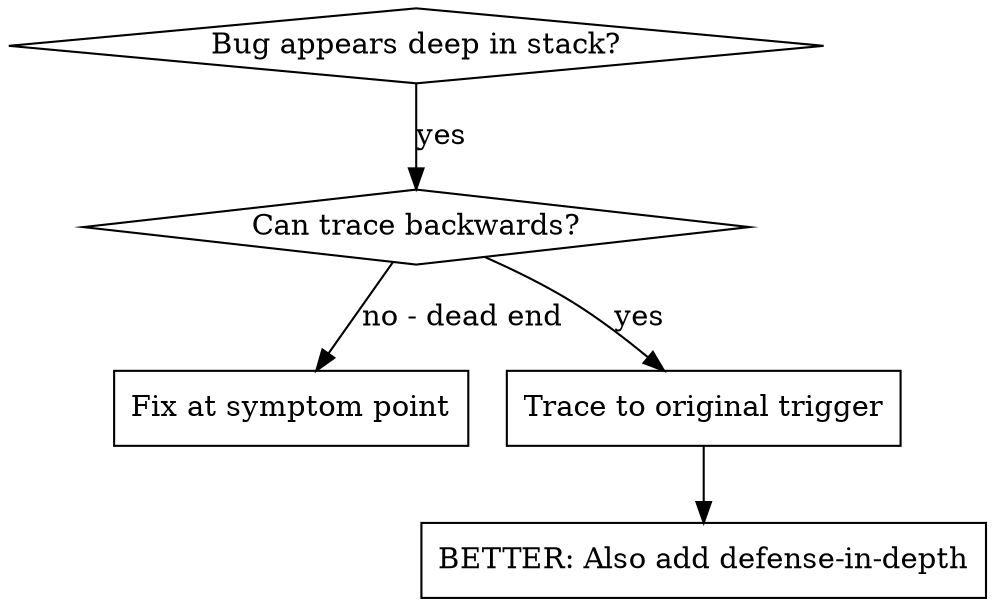
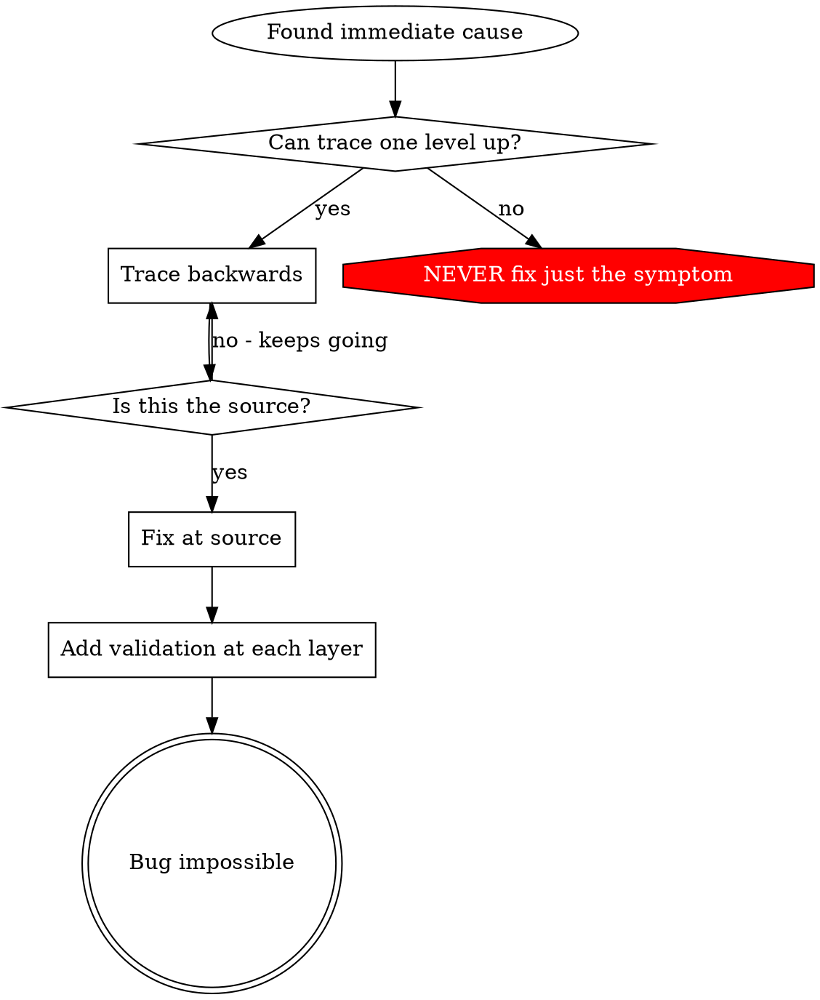

# 根因追踪（Root Cause Tracing）

## 概述

bug 常常在调用栈深处显现（在错误的目录里 git init、文件建在了错误的位置、数据库用错误的路径打开）。你的直觉是在错误出现的地方修，但那是治症状。

**核心原则：** 沿调用链向后追踪，直到找到原始触发器，然后在源头修。

## 何时使用



**用于：**
- 错误发生在执行深处（不在入口处）
- 堆栈跟踪显示很长的调用链
- 不清楚无效数据源自哪里
- 需要找出是哪个测试/代码触发了问题

## 追踪流程

### 1. 观察症状
```
Error: git init failed in ~/project/packages/core
```

### 2. 找直接原因
**什么代码直接导致了这个？**
```typescript
await execFileAsync('git', ['init'], { cwd: projectDir });
```

### 3. 问：谁调用了它？
```typescript
WorktreeManager.createSessionWorktree(projectDir, sessionId)
  → called by Session.initializeWorkspace()
  → called by Session.create()
  → called by test at Project.create()
```

### 4. 继续往上追
**传了什么值？**
- `projectDir = ''`（空字符串！）
- 空字符串作为 `cwd` 会解析为 `process.cwd()`
- 那正是源码目录！

### 5. 找原始触发器
**空字符串从哪来？**
```typescript
const context = setupCoreTest(); // Returns { tempDir: '' }
Project.create('name', context.tempDir); // Accessed before beforeEach!
```

## 添加堆栈跟踪

手动追踪不了时，添加插桩：

```typescript
// Before the problematic operation
async function gitInit(directory: string) {
  const stack = new Error().stack;
  console.error('DEBUG git init:', {
    directory,
    cwd: process.cwd(),
    nodeEnv: process.env.NODE_ENV,
    stack,
  });

  await execFileAsync('git', ['init'], { cwd: directory });
}
```

**关键：** 测试中用 `console.error()`（不要用 logger——可能不显示）

**运行并捕获：** 用 `bash` 工具运行（长任务可加 `run_in_background:true`，再用 `job_output` 收集）：

```bash
npm test 2>&1 | grep 'DEBUG git init'
```

**分析堆栈跟踪：**
- 找测试文件名
- 找出触发调用的行号
- 识别模式（同一个测试？同一个参数？）

## 找出是哪个测试造成污染

如果测试期间出现了某些东西，但你不知道是哪个测试：

用二分法定位"污染者"：把测试集分成两半分别运行，哪一半仍出现污染就继续二分那一半，直到定位到单个测试；也可以逐个测试运行（更慢但更直接）。停下的第一个测试就是污染源。

## 真实案例：空的 projectDir

**症状：** `.git` 被建在了 `packages/core/`（源码）里

**追踪链：**
1. `git init` 在 `process.cwd()` 中运行 ← 空的 cwd 参数
2. WorktreeManager 收到空的 projectDir
3. Session.create() 传了空字符串
4. 测试在 beforeEach 之前访问 `context.tempDir`
5. setupCoreTest() 初始返回 `{ tempDir: '' }`

**根因：** 顶层变量初始化访问了空值

**修复：** 把 tempDir 改成 getter，在 beforeEach 之前访问就抛错

**同时添加纵深防御：**
- 第 1 层：Project.create() 校验目录
- 第 2 层：WorkspaceManager 校验非空
- 第 3 层：NODE_ENV 守卫拒绝在 tmpdir 之外 git init
- 第 4 层：git init 前记录堆栈跟踪

## 关键原则



**绝不只在错误出现的地方修。** 往回追踪，找到原始触发器。

## 堆栈跟踪小贴士

**测试中：** 用 `console.error()` 而不是 logger——logger 可能被抑制
**操作前：** 在危险操作之前记录，而不是它失败之后
**包含上下文：** 目录、cwd、环境变量、时间戳
**捕获堆栈：** `new Error().stack` 显示完整调用链

## 真实影响

来自 2025-10-03 的调试会话：
- 通过 5 层追踪找到根因
- 在源头修（getter 校验）
- 加了 4 层防御
- 1847 个测试全部通过，零污染
