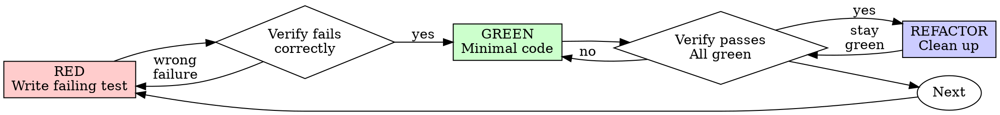

# 测试驱动开发（TDD）

## 概述

先写测试。看着它失败。写最少量的代码让它通过。

**核心原则：** 如果你没有看着测试失败，你就不知道它测的是不是正确的东西。

**违反规则的条文，就是违反规则的精神。**

## 何时使用

**总是：**
- 新功能
- Bug 修复
- 重构
- 行为变更

**例外（询问你的人类搭档）：**
- 一次性原型
- 生成的代码
- 配置文件

心想"就这一次跳过 TDD"？停下。那是自我合理化。

## 铁律

```
没有先失败的测试，就不允许写生产代码
```

在测试之前写了代码？删掉。重新开始。

**没有例外：**
- 不要留着当"参考"
- 不要在写测试时"改编"它
- 不要看它
- 删就是删

完全从测试开始实现。没有商量余地。

## 红-绿-重构（Red-Green-Refactor）



### RED - 写失败测试

写一个最小测试，说明应该发生什么。

<Good>
```typescript
test('retries failed operations 3 times', async () => {
  let attempts = 0;
  const operation = () => {
    attempts++;
    if (attempts < 3) throw new Error('fail');
    return 'success';
  };

  const result = await retryOperation(operation);

  expect(result).toBe('success');
  expect(attempts).toBe(3);
});
```
清晰的命名，测试真实行为，只测一件事
</Good>

<Bad>
```typescript
test('retry works', async () => {
  const mock = jest.fn()
    .mockRejectedValueOnce(new Error())
    .mockRejectedValueOnce(new Error())
    .mockResolvedValueOnce('success');
  await retryOperation(mock);
  expect(mock).toHaveBeenCalledTimes(3);
});
```
含糊的命名，测的是 mock 而不是代码
</Bad>

**要求：**
- 只测一个行为
- 清晰的命名
- 真实代码（除非不可避免，否则不用 mock）

### 验证 RED - 看着它失败

**强制。绝不跳过。**

用 `bash` 工具运行测试命令（可按需指定 `workdir`、`timeoutMs`）：

```bash
npm test path/to/test.test.ts
```

确认：
- 测试失败（而不是报错）
- 失败信息符合预期
- 失败是因为功能缺失（而不是拼写错误）

**测试通过了？** 你在测已有行为。修正测试。

**测试报错？** 修正错误，重新运行，直到它以正确的方式失败。

### GREEN - 最少代码

写最简单的代码让测试通过。

<Good>
```typescript
async function retryOperation<T>(fn: () => Promise<T>): Promise<T> {
  for (let i = 0; i < 3; i++) {
    try {
      return await fn();
    } catch (e) {
      if (i === 2) throw e;
    }
  }
  throw new Error('unreachable');
}
```
刚好够通过
</Good>

<Bad>
```typescript
async function retryOperation<T>(
  fn: () => Promise<T>,
  options?: {
    maxRetries?: number;
    backoff?: 'linear' | 'exponential';
    onRetry?: (attempt: number) => void;
  }
): Promise<T> {
  // YAGNI
}
```
过度设计
</Bad>

不要添加测试之外的功能，不要重构其它代码，不要"顺手改进"。

### 验证 GREEN - 看着它通过

**强制。**

用 `bash` 工具运行测试：

```bash
npm test path/to/test.test.ts
```

确认：
- 测试通过
- 其它测试仍然通过
- 输出干净（无错误、无警告）

**测试失败？** 修代码，不是修测试。

**其它测试失败？** 现在立刻修。

### REFACTOR - 清理

只在变绿之后：
- 消除重复
- 改进命名
- 提取辅助函数

保持测试全绿。不要添加行为。

### 重复

写下一个功能的失败测试。

## 好测试

| 品质 | 好 | 坏 |
|---------|------|-----|
| **最小** | 只测一件事。名字里有"和"？拆开。 | `test('validates email and domain and whitespace')` |
| **清晰** | 名字描述行为 | `test('test1')` |
| **表达意图** | 演示期望的 API | 掩盖代码应该做什么 |

写或改任何测试时，阅读 [writing-good-tests.md](writing-good-tests.md)，遵守让测试保持诚实的规则：
- 在写测试之前，说出会让它失败的生产变更
- 断言真实行为，绝不断言 mock 行为
- 测试专用代码放在测试工具里，不进生产类
- 在 mock 依赖之前，先理解它的副作用

## 常见自我合理化

| 借口 | 现实 |
|--------|--------|
| "太简单了不用测" | 简单的代码也会坏。测试只要 30 秒。 |
| "我之后会补测试" | 事后写的测试立即通过——这什么也证明不了。它们可能测错了东西，测了实现而不是行为，或者漏掉了你忘记的边界情况。你从没看着它失败，所以从没证明它能抓住 bug。测试先行强制这个失败。 |
| "事后测试也能达到同样目标（重精神不重仪式）" | 事后测试回答"这是干什么的？"；先行测试回答"它应该干什么？"。事后写的测试被你已写的代码带偏——你验证的是你记得的情况，而不是你会发现的那些。有覆盖率却没有测试有效的证明。 |
| "已经手动测过了" | 手动测试是临时性的：没有覆盖记录，代码变化后无法重跑，压力下容易漏掉情况。"我试的时候能跑" ≠ 全面。自动化测试每次以同样方式运行。 |
| "删掉 X 小时的成果太浪费" | 沉没成本谬误——那段时间无论怎样都已花掉。真正的选择：用 TDD 重写（高置信）vs. 留着它事后补测（低置信、很可能有 bug）。留着你不信任的代码才是浪费。 |
| "留着当参考，先写测试" | 你会改编它。那就是事后测试。删就是删。 |
| "需要先探索" | 可以。扔掉探索成果，从 TDD 开始。 |
| "难测 = 设计不清" | 听测试的。难测 = 难用。 |
| "TDD 会拖慢我" | TDD 就是务实的路径：提交前抓住 bug、防止回归、让你无惧重构。"务实"的捷径意味着在生产环境调试——更慢，不是更快。 |
| "手动测试更快" | 手动证明不了边界情况。每次变更你都要重新测。 |
| "现有代码没有测试" | 你正在改进它。给现有代码补测试。 |

## 危险信号 - 停下并重新开始

- 测试之前就有代码
- 实现之后才补测试
- 测试立即通过
- 无法解释测试为什么失败
- "稍后"再补测试
- 合理化"就这一次"
- "我已经手动测过了"
- "事后测试也能达到同样目的"
- "重要的是精神不是仪式"
- "留着当参考"或"改编现有代码"
- "已经花了 X 小时，删掉太浪费"
- "TDD 太教条，我要务实"
- "这次不一样，因为……"

**所有这些都意味着：删掉代码。用 TDD 重新开始。**

## 示例：Bug 修复

**Bug：** 空邮箱被接受

**RED**
```typescript
test('rejects empty email', async () => {
  const result = await submitForm({ email: '' });
  expect(result.error).toBe('Email required');
});
```

**验证 RED**
```bash
$ npm test
FAIL: expected 'Email required', got undefined
```

**GREEN**
```typescript
function submitForm(data: FormData) {
  if (!data.email?.trim()) {
    return { error: 'Email required' };
  }
  // ...
}
```

**验证 GREEN**
```bash
$ npm test
PASS
```

**REFACTOR**
如需支持多字段校验，提取校验逻辑。

## 验证清单

在标记工作完成之前：

- [ ] 每个新函数/方法都有测试
- [ ] 实现前看过每个测试失败
- [ ] 每个测试都因预期原因失败（功能缺失，而非拼写错误）
- [ ] 为通过每个测试写了最少代码
- [ ] 所有测试通过
- [ ] 输出干净（无错误、无警告）
- [ ] 测试用真实代码（只有不可避免时才用 mock）
- [ ] 覆盖边界情况和错误

有勾不上的？你跳过了 TDD。重新开始。

## 卡住时

| 问题 | 解法 |
|---------|----------|
| 不知道怎么测 | 写你想要的 API。先写断言。问你的人类搭档。 |
| 测试太复杂 | 设计太复杂。简化接口。 |
| 什么都得 mock | 代码耦合太紧。用依赖注入。 |
| 测试设置巨大 | 提取辅助函数。还是复杂？简化设计。 |

## 与调试的集成

发现 bug？写一个复现它的失败测试。走 TDD 循环。测试证明修复有效，并防止回归。

永远不要在没测试的情况下修 bug。

## 最终规则

```
生产代码 → 先有测试，且测试先失败过
否则 → 不是 TDD
```

未经你的人类搭档许可，没有例外。
