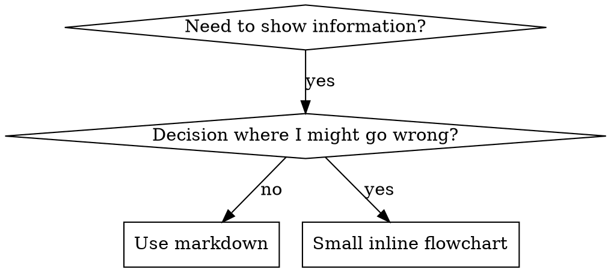

# 编写技能

## 概述

**编写技能就是把测试驱动开发（TDD）应用到流程文档上。**

**个人技能存放在 DSH 的技能目录**（本仓库的 `skills/` 目录，每个技能一个 `superpower-<skill>/` 目录，内含 `SKILL.md`）。

你先写测试用例（带压力的子代理场景），看它们失败（基线行为），再写技能（文档），看测试通过（代理遵守），然后重构（堵上漏洞）。

**核心原则：** 如果你没亲眼看到代理在缺少该技能时失败，你就不知道这个技能是否教对了东西。

**REQUIRED BACKGROUND（必备背景）：** 使用本技能之前，你必须理解 superpower-test-driven-development。该技能定义了基本的 RED-GREEN-REFACTOR 循环。本技能把 TDD 适配到文档上。

## 什么是技能？

**技能**是经过验证的技术、模式或工具的参考指南。技能帮助未来的代理找到并应用有效的方法。

**技能是：** 可复用的技术、模式、工具、参考指南

**技能不是：** 关于你某次如何解决一个问题的叙述故事

## 技能的 TDD 映射

| TDD 概念 | 技能创建 |
|-------------|---------|
| **测试用例** | 带压力的子代理场景 |
| **生产代码** | 技能文档（SKILL.md） |
| **测试失败（RED）** | 没有技能时代理违反规则（基线） |
| **测试通过（GREEN）** | 有技能时代理遵守 |
| **重构** | 在保持遵守的同时堵上漏洞 |
| **先写测试** | 写技能之前先跑基线场景 |
| **看它失败** | 逐字记录代理使用的自我合理化 |
| **最小代码** | 写针对那些具体违规的技能 |
| **看它通过** | 验证代理现在遵守了 |
| **重构循环** | 发现新的合理化 → 堵住 → 再验证 |

整个技能创建过程遵循 RED-GREEN-REFACTOR。

## 何时创建技能

**创建当：**
- 技术对你来说不是直觉上显然的
- 你会跨项目再次引用它
- 模式广泛适用（不是项目特定的）
- 其他人会受益

**不要为以下创建：**
- 一次性解决方案
- 别处已有完善文档的标准实践
- 项目特定的约定（放进你的指令文件）
- 机械性约束（如果能用正则/校验强制，就自动化它——把文档留给判断类工作）

## 技能类型

### 技术（Technique）
有步骤可循的具体方法（condition-based-waiting、root-cause-tracing）

### 模式（Pattern）
看待问题的思维方式（flatten-with-flags、test-invariants）

### 参考（Reference）
API 文档、语法指南、工具文档（office docs）

## 目录结构

```
skills/
  skill-name/
    SKILL.md              # 主参考文档（必需）
    supporting-file.*     # 仅当需要时
```

**扁平命名空间** - 所有技能在一个可搜索的命名空间里

**单独文件用于：**
1. **重参考**（100+ 行）- API 文档、完整语法
2. **可复用工具** - 脚本、工具、模板

**内联保留：**
- 原则与概念
- 代码模式（< 50 行）
- 其它一切

## SKILL.md 结构

**Frontmatter（YAML）：**
- 两个必填字段：`name` 和 `description`（所有支持的字段见 [agentskills.io/specification](https://agentskills.io/specification)）
- 总共最多 1024 字符
- `name`：只用字母、数字和连字符（不能用括号、特殊字符）
- `description`：第三人称，只描述何时使用（不是它做什么）
  - 以 "Use when..." 开头，聚焦触发条件
  - 包含具体症状、情境和上下文
  - **绝不要总结技能的流程或工作流**（见下方 SDO 一节的原因）
  - 尽量控制在 500 字符以内

```markdown
---
name: Skill-Name-With-Hyphens
description: Use when [specific triggering conditions and symptoms]
---

# Skill Name

## Overview
这是什么？1-2 句核心原则。

## When to Use
[如果决策不明显，放一个小型内联流程图]

带 SYMPTOMS 和用例的要点列表
何时不要用

## Core Pattern（技术/模式类）
前后代码对比

## Quick Reference
用于快速扫读常见操作的表格或要点

## Implementation
简单模式内联代码
重参考或可复用工具链接到文件

## Common Mistakes
什么会出错 + 修正

## Real-World Impact（可选）
具体结果
```

## 技能发现优化（SDO）

**对发现至关重要：** 未来的代理需要"找到"你的技能

### 1. 丰富的 Description 字段

**目的：** 代理会读 description 来决定某个任务该加载哪些技能。让它能回答："我现在该读这个技能吗？"

**格式：** 以 "Use when..." 开头，聚焦触发条件

**关键：Description = 何时使用，不是技能做什么**

description 只应描述触发条件。不要在 description 里总结技能的流程或工作流。

**为什么重要：** 测试表明，当 description 总结了技能的工作流时，代理可能会照着 description 做，而不去读完整的技能正文。一个写着 "code review between tasks" 的 description 让代理只做了一次评审，尽管技能的流程图清楚显示了两次评审（规格符合性 + 代码质量）。

当 description 改成只是 "Use when executing implementation plans with independent tasks"（不含工作流总结）后，代理正确读取了流程图并遵循两阶段评审流程。

**陷阱：** 总结工作流的 description 制造了代理会走的捷径。技能正文变成了代理跳过的文档。

```yaml
# ❌ 坏：总结工作流 - 代理可能照着它做而不读技能
description: Use when executing plans - dispatches subagent per task with code review between tasks

# ❌ 坏：流程细节太多
description: Use for TDD - write test first, watch it fail, write minimal code, refactor

# ✅ 好：只是触发条件，没有工作流总结
description: Use when executing implementation plans with independent tasks in the current session

# ✅ 好：只有触发条件
description: Use when implementing any feature or bugfix, before writing implementation code
```

**内容：**
- 用具体的触发器、症状和情境来标示该技能适用
- 描述*问题*（竞态条件、行为不一致），而不是*语言特定症状*（setTimeout、sleep）
- 除非技能本身就是技术特定的，否则触发器要保持技术无关
- 如果技能是技术特定的，就在触发器里明确说明
- 用第三人称写（会注入系统提示）
- **绝不要总结技能的流程或工作流**

```yaml
# ❌ 坏：太抽象、含糊、没包含何时使用
description: For async testing

# ❌ 坏：第一人称
description: I can help you with async tests when they're flaky

# ❌ 坏：提到了技术但技能并非针对它
description: Use when tests use setTimeout/sleep and are flaky

# ✅ 好：以 "Use when" 开头，描述问题，无工作流
description: Use when tests have race conditions, timing dependencies, or pass/fail inconsistently

# ✅ 好：技术特定技能，显式触发器
description: Use when using React Router and handling authentication redirects
```

### 2. 关键词覆盖

用代理会搜索的词：
- 错误消息："Hook timed out"、"ENOTEMPTY"、"race condition"
- 症状："flaky"、"hanging"、"zombie"、"pollution"
- 同义词："timeout/hang/freeze"、"cleanup/teardown/afterEach"
- 工具：实际命令、库名、文件类型

### 3. 描述性命名

**用主动语态，动词开头：**
- ✅ `creating-skills` 而不是 `skill-creation`
- ✅ `condition-based-waiting` 而不是 `async-test-helpers`

### 4. Token 效率（关键）

**问题：** 入门型和频繁引用的技能会加载进每一次对话。每个 token 都算数。

**目标字数：**
- 入门型工作流：每个 <150 词
- 频繁加载的技能：总共 <200 词
- 其它技能：<500 词（仍要简洁）

**技巧：**

**把细节移进工具帮助：**
```bash
# ❌ 坏：在 SKILL.md 里记录所有 flag
search-conversations supports --text, --both, --after DATE, --before DATE, --limit N

# ✅ 好：引用 --help
search-conversations supports multiple modes and filters. Run --help for details.
```

**使用交叉引用：**
```markdown
# ❌ 坏：重复工作流细节
When searching, dispatch subagent with template...
[20 lines of repeated instructions]

# ✅ 好：引用其它技能
Always use subagents (50-100x context savings). REQUIRED: Use [other-skill-name] for workflow.
```

**压缩示例：**
```markdown
# ❌ 坏：冗长示例（42 词）
你的搭档: "我们之前在 React Router 里怎么处理认证错误的？"
你：我会搜索过去的对话找 React Router 认证模式。
[派遣子代理搜索："React Router authentication error handling 401"]

# ✅ 好：最小示例（20 词）
搭档: "我们之前在 React Router 里怎么处理认证错误的？"
你：搜索中...
[派遣子代理 → 综合]
```

**消除冗余：**
- 不要重复交叉引用技能里已有的内容
- 不要解释命令里显而易见的东西
- 不要放多个同一模式的示例

**验证：**
```bash
wc -w skills/path/SKILL.md
# 入门型工作流：目标是每个 <150
# 其它频繁加载的：目标总共 <200
```

**按你*做什么*或核心洞见命名：**
- ✅ `condition-based-waiting` > `async-test-helpers`
- ✅ `using-skills` 而不是 `skill-usage`
- ✅ `flatten-with-flags` > `data-structure-refactoring`
- ✅ `root-cause-tracing` > `debugging-techniques`

**动名词（-ing）很适合流程：**
- `creating-skills`、`testing-skills`、`debugging-with-logs`
- 主动，描述你正在采取的行动

### 5. 交叉引用其它技能

**写引用其它技能的文档时：**

只用技能名，带明确的必需性标记：
- ✅ 好：`**REQUIRED SUB-SKILL:** Use superpower-test-driven-development`
- ✅ 好：`**REQUIRED BACKGROUND:** You MUST understand superpower-systematic-debugging`
- ❌ 坏：`See skills/testing/test-driven-development`（不清楚是否必需）
- ❌ 坏：`@skills/testing/test-driven-development/SKILL.md`（强制加载，烧上下文）

**为什么不用 @ 链接：** `@` 语法会立即强制加载文件，在你需要它们之前就消耗掉大量上下文。

## 流程图使用



**只在以下情况用流程图：**
- 不明显的决策点
- 你可能过早停下的流程循环
- "该用 A 还是 B" 的决策

**绝不要用流程图做：**
- 参考材料 → 表格、列表
- 代码示例 → Markdown 代码块
- 线性指令 → 编号列表
- 无语义含义的标签（step1、helper2）

**可视化给你的人类搭档看：** 如需把技能里的流程图渲染成 SVG，直接用 graphviz 渲染（如 `dot -Tsvg flowchart.dot -o flowchart.svg`，每个图单独渲染，或合并进一个 SVG）。

## 代码示例

**一个优秀的示例胜过许多平庸的示例**

选最相关的语言：
- 测试技术 → TypeScript/JavaScript
- 系统调试 → Shell/Python
- 数据处理 → Python

**好示例：**
- 完整可运行
- 注释充分，解释 WHY
- 来自真实场景
- 清楚展示模式
- 可直接改编（不是通用模板）

**不要：**
- 用 5+ 种语言实现
- 做填空模板
- 写牵强附会的示例

你擅长移植——一个极好的示例就够了。

## 文件组织

### 自包含技能
```
defense-in-depth/
  SKILL.md    # 全部内联
```
何时：所有内容放得下，不需要重参考

### 带可复用工具的技能
```
condition-based-waiting/
  SKILL.md    # 概述 + 模式
  example.ts  # 可改编的工作辅助代码
```
何时：工具是可复用代码，不只是叙述

### 带重参考的技能
```
pptx/
  SKILL.md       # 概述 + 工作流
  pptxgenjs.md   # 600 行 API 参考
  ooxml.md       # 500 行 XML 结构
  scripts/       # 可执行工具
```
何时：参考材料太大，内联放不下

## 铁律（与 TDD 相同）

```
NO SKILL WITHOUT A FAILING TEST FIRST
（没有先失败的测试，就没有技能）
```

这对新技能和现有技能的编辑都适用。

没测试就写了技能？删掉重来。
没测试就编辑技能？同样的违规。

**没有例外：**
- "简单补充"也不行
- "只是加一节"也不行
- "文档更新"也不行
- 不要把未测试的改动留作"参考"
- 跑测试时不要"顺手改编"
- 删就是删

**REQUIRED BACKGROUND：** superpower-test-driven-development 技能解释了为什么这很重要。同样的原则适用于文档。

## 测试所有技能类型

不同类型的技能需要不同的测试方法：

### 纪律强制型技能（规则/要求）

**示例：** TDD、verification-before-completion、designing-before-coding

**测试用：**
- 学术性问题：他们理解规则吗？
- 压力场景：他们在压力下会遵守吗？
- 多重压力叠加：时间 + 沉没成本 + 精疲力竭
- 识别合理化并加显式反制

**成功标准：** 代理在最大压力下遵守规则

### 技术型技能（如何做指南）

**示例：** condition-based-waiting、root-cause-tracing、defensive-programming

**测试用：**
- 应用场景：他们能正确应用该技术吗？
- 变体场景：他们处理边界情况吗？
- 信息缺失测试：指令有缺口吗？

**成功标准：** 代理成功把技术应用到新场景

### 模式型技能（心智模型）

**示例：** reducing-complexity、information-hiding 概念

**测试用：**
- 识别场景：他们能识别模式何时适用吗？
- 应用场景：他们能使用这个心智模型吗？
- 反例：他们知道何时*不*该用吗？

**成功标准：** 代理正确识别何时/如何应用模式

### 参考型技能（文档/API）

**示例：** API 文档、命令参考、库指南

**测试用：**
- 检索场景：他们能找到正确信息吗？
- 应用场景：他们能正确使用找到的东西吗？
- 缺口测试：常见用例都覆盖了吗？

**成功标准：** 代理找到并正确应用参考信息

## 跳过测试的常见自我合理化

| 借口 | 现实 |
|--------|---------|
| "技能显然很清楚" | 你觉得清楚 ≠ 其它代理觉得清楚。测试它。 |
| "它只是参考文档" | 参考文档也有缺口、有不清楚的段落。测试检索。 |
| "测试是小题大做" | 未测试的技能总有问题。永远。15 分钟测试省几小时。 |
| "出问题了再测" | 出问题 = 代理用不了技能。部署*之前*测。 |
| "太繁琐不想测" | 测试没有在生产里调试坏技能繁琐。 |
| "我确信它很好" | 过度自信保证出问题。照样测。 |
| "学术性评审就够了" | 读 ≠ 用。测试应用场景。 |
| "没时间测" | 部署未测试的技能，之后修它浪费更多时间。 |

**这些都意味着：先测试再部署。没有例外。**

## 让形式匹配失败模式

写指导之前，先给基线失败分类。对一种失败类型坚不可摧的形式，对另一种会被可测量地反噬。

| 基线失败 | 正确的形式 | 错误的形式 |
|---|---|---|
| 压力下跳过/违反规则（知道更好，还是做了） | 禁令 + 合理化表 + 危险信号（见下方 Bulletproofing） | 软指导（"prefer..."、"consider..."） |
| 遵守了，但输出形状不对（臃肿的 prompt、被埋没的结论、复述规格） | 正面配方或契约：陈述输出*是什么*——它的各部分、按顺序 | 禁令清单（"don't restate"、"never narrate"） |
| 从他们已经产出的东西里漏掉一个必需元素 | 结构性：在他们填的模板里放 REQUIRED 字段或槽位 | 模板附近的散文提醒 |
| 行为应当依赖某个条件 | 绑定到可观察谓词的条件式（"if the brief exists, reference it"） | 无条件规则 + 豁免条款 |

**为什么禁令在塑形问题上反噬：** 在竞争性激励下（"让 prompt 自包含"），代理会和 "don't X" 讨价还价。在 dispatch-prompt 指导的面对面措辞测试中，禁令组产生的多余内容明显多于配方组（分布完全分离），甚至比无指导对照组还差——要微测试你自己的案例而不是想当然，但默认绝不伸手拿禁令。配方没有可讨价还价的余地：输出符合所述形状，或者不符合。

**无论你选哪种形式都适用的规则：**
- **不要让步从句。** "除非重要否则别 X" 重新打开了讨价还价——在同样的措辞测试里，给一个胜出的配方追加一条让步从句，把它从一致退化成了嘈杂。真正的例外要用它自己的、基于可观察谓词的条件式来表达。
- **豁免条款不会划定范围。** "这个限制不适用于代码块" 仍然会压制代码块。如果输出的某部分必须豁免，就重构结构，让规则够不到它。

## 让技能对自我合理化免疫（Bulletproofing）

强制纪律的技能（如 TDD）需要抵抗自我合理化。代理很聪明，在压力下会找漏洞。

**适用范围：** 这套工具针对纪律失败——代理知道规则却在压力下跳过。对于形状错误的输出或漏掉的元素，基于禁令的 bulletproofing 会反噬；改用上方"让形式匹配失败模式"里的形式。

**心理学注：** 理解说服技巧为何有效，能帮你系统地应用它们。研究基础（Cialdini, 2021；Meincke et al., 2025）关于权威、承诺、稀缺、社会认同和一致（unity）原则，见 persuasion-principles.md。

### 明确堵上每一个漏洞

不要只陈述规则——要禁止具体的工作绕法：

<坏>
```markdown
Write code before test? Delete it.
```
</坏>

<好>
```markdown
Write code before test? Delete it. Start over.

**No exceptions:**
- Don't keep it as "reference"
- Don't "adapt" it while writing tests
- Don't look at it
- Delete means delete
```
</好>

### 应对"精神 vs 字面"之争

早点加基础原则：

```markdown
**Violating the letter of the rules is violating the spirit of the rules.**
（违反规则的条文就是违反规则的精神。）
```

这切断了一整类"我在遵循精神"的自我合理化。

### 建立合理化表

从基线测试（见下方"测试"一节）中捕获合理化。代理说的每个借口都进表：

```markdown
| Excuse | Reality |
|--------|---------|
| "Too simple to test" | Simple code breaks. Test takes 30 seconds. |
| "I'll test after" | Tests passing immediately prove nothing. |
| "Tests after achieve same goals" | Tests-after = "what does this do?" Tests-first = "what should this do?" |
```

### 创建危险信号清单

让代理在自我合理化时容易自检：

```markdown
## Red Flags - STOP and Start Over

- Code before test
- "I already manually tested it"
- "Tests after achieve the same purpose"
- "It's about spirit not ritual"
- "This is different because..."

**All of these mean: Delete code. Start over with TDD.**
```

### 为违规症状更新 SDO

把"你即将违规时"的症状加进 description：

```yaml
description: use when implementing any feature or bugfix, before writing implementation code
```

## 技能的 RED-GREEN-REFACTOR

遵循 TDD 循环：

### RED：写失败测试（基线）

不带技能跑压力场景。逐字记录实际行为：
- 他们做了哪些选择？
- 他们用了哪些自我合理化（原文）？
- 哪些压力触发了违规？

这就是"看着测试失败"——写技能之前，你必须看到代理自然的行为。

### GREEN：写最小技能

写针对那些具体合理化的技能。不要为假设的情况加多余内容。

带技能重跑同样的场景。代理现在应当遵守。

### REFACTOR：堵上漏洞

代理发现了新的合理化？加显式反制。反复测试直到坚不可摧。

### 在完整场景之前先微测试措辞

完整的压力场景运行是最后一道门，但每次迭代又慢又贵。先用微测试验证措辞本身：

1. **每次调用一个全新上下文的样本** — 一次裸 API 调用；如果没有 API 访问权，就用一次性子代理。系统提示 = 该指导将要栖身的现实上下文（完整技能或 prompt 模板，不是孤立的指导）；用户消息 = 一个引诱失败的任务。
2. **永远带一个无指导对照组。** 如果对照组没有表现出失败，就没有什么可修的——停下，不要撰写指导。
3. **每个变体 5+ 次重复。** 单一样本会撒谎。
4. **人工读每个被标记的匹配。** 想用程序打分也可以，但模板回声和被引用的反例伪装成命中；仅自动计数会同时高估失败和成功。
5. **方差是度量。** 指导落地时，重复会收敛到同一形状。五次重复五种不同解读 = 措辞没有约束力——先收紧形式，再加词。

微测试验证措辞；它们不能替代纪律型技能的压力场景。

**测试方法论：** 完整的测试方法论见 [testing-skills-with-subagents.md](testing-skills-with-subagents.md)：
- 如何写压力场景
- 压力类型（时间、沉没成本、权威、精疲力竭）
- 系统化地堵洞
- 元测试技巧

## 反模式

### ❌ 叙述式示例
"In session 2025-10-03, we found empty projectDir caused..."
**为什么不好：** 太具体，不可复用

### ❌ 多语言稀释
example-js.js、example-py.py、example-go.go
**为什么不好：** 平庸的质量，维护负担

### ❌ 流程图里的代码
```dot
step1 [label="import fs"];
step2 [label="read file"];
```
**为什么不好：** 不能复制粘贴，难以阅读

### ❌ 通用标签
helper1、helper2、step3、pattern4
**为什么不好：** 标签应有语义含义

## 停：进入下一个技能之前

**写完任何技能后，你必须停下并完成部署流程。**

**不要：**
- 不逐个测试就批量创建多个技能
- 当前技能验证完之前就进入下一个
- 因为"批量更高效"而跳过测试

**下面的部署清单对每个技能都是强制的。**

部署未测试的技能 = 部署未测试的代码。这是对质量标准的违反。

## 技能创建清单（TDD 改编）

**重要：用 `todo_write` 为下面每一项创建一个待办。**

**RED 阶段 - 写失败测试：**
- [ ] 创建压力场景（纪律型技能要 3+ 种压力叠加）
- [ ] 不带技能跑场景——逐字记录基线行为
- [ ] 识别合理化/失败的模式

**GREEN 阶段 - 写最小技能：**
- [ ] 名字只用字母、数字、连字符（无括号/特殊字符）
- [ ] YAML frontmatter 含必填的 `name` 和 `description` 字段（最多 1024 字符；见 [spec](https://agentskills.io/specification)）
- [ ] description 以 "Use when..." 开头，含具体触发器/症状
- [ ] description 用第三人称
- [ ] 全文有关键词利于搜索（错误、症状、工具）
- [ ] 清晰的概述 + 核心原则
- [ ] 针对 RED 阶段识别出的具体基线失败
- [ ] 指导形式匹配失败类型（见"让形式匹配失败模式"）
- [ ] 行为塑形指导：措辞对无指导对照组做过微测试（5+ 次重复，每个被标记匹配都人工读）——纯参考技能不适用
- [ ] 代码内联，或链接到单独文件
- [ ] 一个优秀示例（不是多语言）
- [ ] 带技能跑场景——验证代理现在遵守

**REFACTOR 阶段 - 堵漏洞：**
- [ ] 从测试中识别出*新的*合理化
- [ ] 加显式反制（如果是纪律型技能）
- [ ] 从所有测试迭代构建合理化表
- [ ] 创建危险信号清单
- [ ] 反复测试直到坚不可摧

**质量检查：**
- [ ] 只有决策不明显时才放小流程图
- [ ] 快速参考表
- [ ] 常见错误一节
- [ ] 没有叙述式讲故事
- [ ] 附属文件只用于工具或重参考

**部署：**
- [ ] 提交技能到 git 并推送到你的 fork（如已配置）
- [ ] 考虑通过 PR 回馈上游（如果广泛有用）

## 发现工作流

未来的代理如何找到你的技能：

1. **遇到问题**（"tests are flaky"）
2. **搜索技能**（grep description，浏览分类）
3. **找到 SKILL**（description 匹配）
4. **扫读概述**（这相关吗？）
5. **读模式**（快速参考表）
6. **加载示例**（只在实现时）

**针对这个流程优化** - 尽早且频繁地放可搜索的词。
